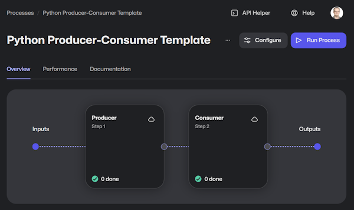

# Template: Python - Producer-Consumer

This example leverages the new [Python framework](https://github.com/robocorp/robocorp), the [libraries](https://github.com/robocorp/robocorp/blob/master/docs/README.md#python-libraries) from to same project as well.

This example contains a working robot implementation that has the basic structure where the first part produces work items from an input and the second one consumes those newly created output work items.

## Tasks

The robot is split into two tasks, meant to run as separate steps in Control Room. The first task generates (produces) data, and the second one reads (consumes) and processes that data.

### The first task (the producer)

- Load the example Excel file from work item created from the email that triggers the process
- Split the Excel file into work items for the consumer

### The second task (the consumer)

> We recommended checking out the article "[Work item exception handling](https://robocorp.com/docs/development-guide/control-room/work-items#work-item-exception-handling)" before diving in.

- Loop through all work items in the queue and access the payloads from the previous step

## Local testing

For best experience to test the work items in this example we recommend using [Robocorp Code -extensions for VS Code](https://robocorp.com/docs/developer-tools/visual-studio-code/extension-features). With the Robocorp Code extension you can simply run and [select the input work items](https://robocorp.com/docs/developer-tools/visual-studio-code/extension-features#using-work-items) to use, create inputs to simulate error cases, and so on.

## Extending the template

> The [producer-consumer](https://en.wikipedia.org/wiki/Producer%E2%80%93consumer_problem) model is not limited to two steps, it can continue so that the consumer generates further work items for the next step and so on.

Start writing Python and remember that the AI/LLM's out there are getting really good and creating Python code specifically.

👉 Try out [Robocorp ReMark 💬](https://chat.robocorp.com)

For more information, do not forget to check out the following:
- [Robocorp Documentation -site](https://robocorp.com/docs)
- [Portal for more examples](https://robocorp.com/portal)
- Follow our main [robocorp -repository](https://github.com/robocorp/robocorp) as it is the main location where we developed the libraries and the framework.